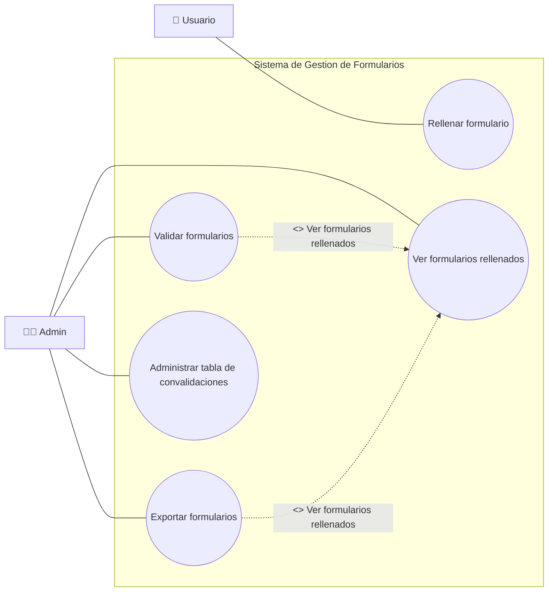

# Resumen de implementacion - Backend DB (SQLite)

## 1) Objetivo cumplido
Se implemento en `backend` un modulo Python que encapsula la logica de acceso a SQLite, junto con scripts de inicializacion/carga y un inventario formal de contratos de entrada/salida.

Archivos principales:
- `backend/scripts/schema.sql`
- `backend/app/db/database.py`
- `backend/app/db/contracts.py`
- `backend/scripts/init_db.py`
- `backend/scripts/load_catalog.py`
- `backend/scripts/load_convalidaciones.py`
- `backend/scripts/export_formularios.py`
- `backend/scripts/README.md`

## 2) Casos de uso y cobertura



Estado de cobertura:

| Caso de uso | Estado | Cobertura en codigo |
|---|---|---|
| UC1 Rellenar formulario | Completo | CRUD de formularios y subentidades (`formulario_solicitudes`, `formulario_modulos_aportados`, `formulario_archivos`) + catalogo para seleccion de modulos |
| UC2 Ver formularios rellenados | Completo | `list_formularios`, `get_formulario` y listados de subentidades |
| UC3 Validar formularios | Completo | Transiciones de estado + motor de reglas (`ALL`/`ANY`) + asignacion automatica de convalidaciones |
| UC4 Exportar formularios | Completo | Funcion unificada de exportacion en DB (`get_formularios_export_data`) y script `export_formularios.py` para salida JSON |
| UC5 Administrar tabla de convalidaciones | Completo | CRUD de convalidacion y de origenes + carga masiva desde JSON/SQLite fuente |

## 3) Esquema SQLite implementado

Se definio el esquema completo con las 11 tablas pedidas:
- `grados`
- `familias`
- `ciclos`
- `modulos`
- `convalidacion`
- `convalidacion_origen`
- `usuarios`
- `formularios`
- `formulario_solicitudes`
- `formulario_modulos_aportados`
- `formulario_archivos`

Diseno aplicado:
- Integridad referencial con `FOREIGN KEY` y politicas `ON DELETE CASCADE`/`SET NULL`.
- Reglas de negocio en DB con `CHECK` (roles `ALUMNO/ADMIN`, estados de formulario, `rule_mode`, `estado_evaluacion`).
- Restricciones `UNIQUE` para evitar duplicados de catalogo.
- Indices para consultas frecuentes (catalogo, formularios, convalidaciones).
- Triggers `updated_at` para mantener auditoria temporal de tablas actualizables.

## 4) Diseno del modulo Python de BD

### 4.1 Arquitectura
- `database.py` concentra toda la interaccion SQL.
- `contracts.py` documenta contratos de entrada/salida exactos por caso de uso.
- Los scripts en `backend/scripts` ejecutan inicializacion y cargas masivas reutilizando `database.py`.

### 4.2 Decisiones tecnicas tomadas
1. Conexion robusta SQLite:
   `row_factory = sqlite3.Row`, `PRAGMA foreign_keys = ON`, `journal_mode = WAL`, `synchronous = NORMAL`.
2. Transacciones seguras:
   contexto `transaction(conn)` con soporte de uso anidado.
3. Validaciones tempranas:
   `_require_non_empty`, `_assert_rule_mode`, `_assert_formulario_estado`, `_assert_formulario_transition`.
4. Paginacion controlada:
   `_normalize_limit_offset` limita rango (`limit` 1..500, `offset >= 0`).
5. Carga idempotente de catalogo:
   funcion `get_or_create_catalog_entity` para evitar duplicidad en cargas repetidas.
6. Motor de reglas deterministico:
   evaluacion por `ALL`/`ANY`, orden de mejor match por mayor coincidencia y menor faltante.
7. Actualizaciones parciales seguras:
   uso de sentinela `_UNSET` en `update_formulario_solicitud`.
8. Encapsulacion reforzada:
   operaciones de limpieza y busqueda de catalogo/convalidaciones usadas por scripts se centralizaron en `database.py`.

## 5) Inventario de funciones por caso de uso (entrada/salida exacta)

La fuente formal de contratos esta en `backend/app/db/contracts.py` (`FUNCTION_CONTRACTS`).
Abajo se resume por caso de uso con firmas exactas.

### UC1 - Rellenar formulario

```python
# Catalogo para selecciones del formulario
list_catalog_entities(conn: sqlite3.Connection, entity: Literal["grado"]) -> Sequence[sqlite3.Row]
list_catalog_entities(conn: sqlite3.Connection, entity: Literal["familia"], parent_id: Optional[int] = None) -> Sequence[sqlite3.Row]
list_catalog_entities(conn: sqlite3.Connection, entity: Literal["ciclo"], parent_id: Optional[int] = None) -> Sequence[sqlite3.Row]
list_catalog_entities(
    conn: sqlite3.Connection,
    entity: Literal["modulo"],
    parent_id: Optional[int] = None,
    search: Optional[str] = None,
    limit: int = 100,
    offset: int = 0,
) -> Sequence[sqlite3.Row]

# Formulario base
create_formulario(
    conn: sqlite3.Connection,
    id_alumno: int,
    estado: FormularioEstado = "BORRADOR",
    anotaciones: Optional[str] = None,
) -> int
update_formulario(
    conn: sqlite3.Connection,
    formulario_id: int,
    *,
    anotaciones: Optional[str] = None,
    validado_por: Optional[int] = None,
) -> bool
submit_formulario(conn: sqlite3.Connection, formulario_id: int) -> bool

# Solicitudes del formulario (modulos destino a convalidar)
create_formulario_solicitud(
    conn: sqlite3.Connection,
    id_formulario: int,
    id_modulo: Optional[int],
    id_convalidacion: Optional[int] = None,
    descripcion: Optional[str] = None,
) -> int
update_formulario_solicitud(
    conn: sqlite3.Connection,
    solicitud_id: int,
    *,
    id_modulo: Optional[int] | object = _UNSET,
    id_convalidacion: Optional[int] | object = _UNSET,
    descripcion: Optional[str] | object = _UNSET,
    estado_evaluacion: Optional[str] | object = _UNSET,
) -> bool
delete_formulario_solicitud(conn: sqlite3.Connection, solicitud_id: int) -> bool

# Modulos aportados por el alumno
create_formulario_modulo_aportado(
    conn: sqlite3.Connection,
    id_formulario: int,
    id_modulo: Optional[int] = None,
    descripcion: Optional[str] = None,
) -> int
update_formulario_modulo_aportado(
    conn: sqlite3.Connection,
    item_id: int,
    *,
    id_modulo: Optional[int] = None,
    descripcion: Optional[str] = None,
) -> bool
delete_formulario_modulo_aportado(conn: sqlite3.Connection, item_id: int) -> bool

# Archivos adjuntos
create_formulario_archivo(
    conn: sqlite3.Connection,
    id_formulario: int,
    nombre_archivo: str,
    ruta_almacenamiento: str,
    *,
    descripcion: Optional[str] = None,
    mime_type: Optional[str] = None,
    size_bytes: Optional[int] = None,
) -> int
delete_formulario_archivo(conn: sqlite3.Connection, archivo_id: int) -> bool
```

### UC2 - Ver formularios rellenados

```python
list_formularios(
    conn: sqlite3.Connection,
    id_alumno: Optional[int] = None,
    estado: Optional[FormularioEstado] = None,
    limit: int = 100,
    offset: int = 0,
) -> Sequence[sqlite3.Row]
get_formulario(conn: sqlite3.Connection, formulario_id: int) -> Optional[sqlite3.Row]
list_formulario_solicitudes(conn: sqlite3.Connection, id_formulario: int) -> Sequence[sqlite3.Row]
list_formulario_modulos_aportados(conn: sqlite3.Connection, id_formulario: int) -> Sequence[sqlite3.Row]
list_formulario_archivos(conn: sqlite3.Connection, id_formulario: int) -> Sequence[sqlite3.Row]
```

### UC3 - Validar formularios

```python
change_formulario_status(
    conn: sqlite3.Connection,
    formulario_id: int,
    new_estado: FormularioEstado,
    *,
    validado_por: Optional[int] = None,
    anotaciones: Optional[str] = None,
) -> bool
review_formulario(
    conn: sqlite3.Connection,
    formulario_id: int,
    *,
    estado: Literal["A_REVISAR", "APROBADO", "RECHAZADO"],
    validado_por: int,
    anotaciones: Optional[str] = None,
) -> bool
evaluate_solicitud(conn: sqlite3.Connection, solicitud_id: int, *, auto_assign: bool = False) -> dict[str, Any]
evaluate_formulario(conn: sqlite3.Connection, formulario_id: int, *, auto_assign: bool = False) -> dict[str, Any]
resolve_formulario_convalidaciones(conn: sqlite3.Connection, formulario_id: int) -> dict[str, Any]
```

### UC4 - Exportar formularios

Cobertura actual en backend DB:

```python
get_formularios_export_data(
    conn: sqlite3.Connection,
    formulario_id: Optional[int] = None,
    id_alumno: Optional[int] = None,
    estado: Optional[FormularioEstado] = None,
    limit: int = 100,
    offset: int = 0,
) -> list[dict[str, Any]]
```

Script operativo:
- `backend/scripts/export_formularios.py` exporta uno o varios formularios a JSON, incluyendo solicitudes, modulos aportados y archivos.

### UC5 - Administrar tabla de convalidaciones

```python
create_convalidacion(
    conn: sqlite3.Connection,
    id_modulo_destino: int,
    source_link: Optional[str],
    source_page: Optional[int],
    origen_modulos: Iterable[int],
    *,
    rule_mode: RuleMode = "ALL",
    source_doc: Optional[str] = None,
    source_anexo: Optional[int] = None,
) -> int
get_convalidacion(conn: sqlite3.Connection, conv_id: int) -> Optional[sqlite3.Row]
list_convalidaciones(conn: sqlite3.Connection) -> Sequence[sqlite3.Row]
list_convalidaciones_for_destino(conn: sqlite3.Connection, id_modulo_destino: int) -> Sequence[sqlite3.Row]
list_convalidacion_origenes(conn: sqlite3.Connection, conv_id: int) -> Sequence[sqlite3.Row]
update_convalidacion(
    conn: sqlite3.Connection,
    conv_id: int,
    id_modulo_destino: int,
    source_link: Optional[str],
    source_page: Optional[int],
    *,
    rule_mode: RuleMode = "ALL",
    source_doc: Optional[str] = None,
    source_anexo: Optional[int] = None,
) -> bool
delete_convalidacion(conn: sqlite3.Connection, conv_id: int) -> bool
add_convalidacion_origen(conn: sqlite3.Connection, conv_id: int, id_modulo: int) -> bool
remove_convalidacion_origen(conn: sqlite3.Connection, conv_id: int, id_modulo: int) -> bool
replace_convalidacion_origenes(conn: sqlite3.Connection, conv_id: int, origen_modulos: Iterable[int]) -> None
```

## 6) Funciones de soporte transversales

```python
connect(config: DBConfig) -> sqlite3.Connection
close(conn: sqlite3.Connection) -> None
init_db(config: DBConfig) -> None
healthcheck(conn: sqlite3.Connection) -> dict[str, Any]
transaction(conn: sqlite3.Connection) -> ContextManager

create_usuario(conn: sqlite3.Connection, nombre: str, email: str, rol: Literal["ALUMNO", "ADMIN"] = "ALUMNO") -> int
get_usuario(conn: sqlite3.Connection, usuario_id: int) -> Optional[sqlite3.Row]
get_usuario_by_email(conn: sqlite3.Connection, email: str) -> Optional[sqlite3.Row]
list_usuarios(conn: sqlite3.Connection) -> Sequence[sqlite3.Row]
```

## 7) Scripts operativos implementados

`backend/scripts/init_db.py`
- Inicializa DB y aplica `schema.sql`.

`backend/scripts/load_catalog.py`
- Carga catalogo FP (`grados/familias/ciclos/modulos`) desde JSON.
- Soporta `--truncate` para recarga completa.

`backend/scripts/load_convalidaciones.py`
- Carga reglas desde JSON o desde SQLite fuente (`Convalidacion` + `Convalidacion_links`).
- Soporta `--reset` para limpiar reglas previas.

`backend/scripts/export_formularios.py`
- Exporta formularios en formato JSON (individual o lote), con filtros por alumno/estado y paginacion.

`backend/scripts/README.md`
- Documenta comandos de uso rapido de los scripts.

## 8) Validacion de implementacion

Validaciones registradas durante la implementacion:
- Compilacion Python sin errores de sintaxis.
- Flujo E2E probado:
  - `init_db` OK.
  - `load_catalog` OK (`4 grados`, `81 familias`, `218 ciclos`, `3272 modulos`).
  - `load_convalidaciones` OK desde SQLite fuente (`281 reglas`).
  - Ejecucion del motor de reglas sobre formulario de ejemplo: OK.

Validacion adicional en esta revision:
- `python -m py_compile backend/app/db/contracts.py backend/app/db/database.py backend/scripts/init_db.py backend/scripts/load_catalog.py backend/scripts/load_convalidaciones.py backend/scripts/export_formularios.py` -> OK.

## 9) Revision Punto Por Punto (Con Citas)

Definicion de tablas pedidas: cumplido.
- `backend/scripts/schema.sql:13`
- `backend/scripts/schema.sql:19`
- `backend/scripts/schema.sql:28`
- `backend/scripts/schema.sql:40`
- `backend/scripts/schema.sql:53`
- `backend/scripts/schema.sql:65`
- `backend/scripts/schema.sql:76`
- `backend/scripts/schema.sql:86`
- `backend/scripts/schema.sql:101`
- `backend/scripts/schema.sql:116`
- `backend/scripts/schema.sql:127`

Scripts de inicializacion/carga: cumplido.
- `backend/scripts/init_db.py:28`
- `backend/scripts/load_catalog.py:62`
- `backend/scripts/load_convalidaciones.py:194`

Modulo Python DB encapsulando logica principal: cumplido.
- Infraestructura de conexion e inicializacion: `backend/app/db/database.py:206`, `backend/app/db/database.py:234`
- CRUD y dominio principal (catalogo/convalidaciones/formularios): `backend/app/db/database.py:255`, `backend/app/db/database.py:525`, `backend/app/db/database.py:728`
- Motor de reglas: `backend/app/db/database.py:1149`, `backend/app/db/database.py:1215`, `backend/app/db/database.py:1313`
- UC4 exportacion dedicada: `backend/app/db/database.py:1108`, `backend/scripts/export_formularios.py:54`

Diseño con funciones identificadas + I/O exacto: cumplido.
- Inventario formal: `backend/app/db/contracts.py:75`
- Cobertura verificada: 53 funciones publicas en `database.py` y 53 funciones inventariadas en `FUNCTION_CONTRACTS`.
Listado completo de funciones publicas del modulo DB (agrupadas por categoria):

Total: 53 funciones.

### Infraestructura
```python
def transaction(conn: sqlite3.Connection):  # Ejecuta un bloque de escritura dentro de una transaccion segura.
def connect(config: DBConfig) -> sqlite3.Connection:  # Abre una conexion SQLite configurada para el proyecto.
def close(conn: sqlite3.Connection) -> None:  # Cierra la conexion activa con la base de datos.
def healthcheck(conn: sqlite3.Connection) -> dict[str, Any]:  # Comprueba conectividad y metadatos basicos de la base de datos.
def init_db(config: DBConfig) -> None:  # Inicializa la base de datos aplicando el esquema SQL.
```

### Catalogo Academico
```python
def clear_catalog(conn: sqlite3.Connection) -> None:  # Limpia el catalogo completo eliminando grados en cascada.
def create_catalog_entity( conn: sqlite3.Connection, entity: Literal["grado", "familia", "ciclo", "modulo"], nombre: str, *, parent_id: Optional[int] = None, titulo: Optional[str] = None, id_oficial: Optional[str] = None, normativa: Optional[str] = None, ) -> int:  # Crea un nuevo registro de catalogo para la entidad indicada.
def get_catalog_entity(conn: sqlite3.Connection, entity: Literal["grado", "familia", "ciclo", "modulo"], entity_id: int) -> Optional[sqlite3.Row]:  # Obtiene un registro de catalogo por entidad e identificador.
def find_catalog_entity_by_nombre( conn: sqlite3.Connection, entity: Literal["grado", "familia", "ciclo", "modulo"], nombre: str, *, parent_id: Optional[int] = None, ) -> Optional[sqlite3.Row]:  # Busca un registro de catalogo por nombre y parent cuando aplica.
def list_catalog_entities( conn: sqlite3.Connection, entity: Literal["grado", "familia", "ciclo", "modulo"], *, parent_id: Optional[int] = None, search: Optional[str] = None, limit: int = 100, offset: int = 0, ) -> Sequence[sqlite3.Row]:  # Lista registros de catalogo por entidad con filtros disponibles.
def update_catalog_entity( conn: sqlite3.Connection, entity: Literal["grado", "familia", "ciclo", "modulo"], entity_id: int, nombre: str, *, parent_id: Optional[int] = None, titulo: Optional[str] = None, id_oficial: Optional[str] = None, normativa: Optional[str] = None, ) -> bool:  # Actualiza un registro de catalogo para la entidad indicada.
def delete_catalog_entity(conn: sqlite3.Connection, entity: Literal["grado", "familia", "ciclo", "modulo"], entity_id: int) -> bool:  # Elimina un registro de catalogo por entidad e identificador.
def get_or_create_catalog_entity( conn: sqlite3.Connection, entity: Literal["grado", "familia", "ciclo", "modulo"], nombre: str, *, parent_id: Optional[int] = None, titulo: Optional[str] = None, id_oficial: Optional[str] = None, normativa: Optional[str] = None, ) -> int:  # Obtiene un registro existente o lo crea si no existe.
```

### Convalidaciones
```python
def clear_convalidaciones(conn: sqlite3.Connection) -> None:  # Limpia todas las convalidaciones y sus modulos origen.
def create_convalidacion( conn: sqlite3.Connection, id_modulo_destino: int, source_link: Optional[str], source_page: Optional[int], origen_modulos: Iterable[int], *, rule_mode: RuleMode = "ALL", source_doc: Optional[str] = None, source_anexo: Optional[int] = None, ) -> int:  # Crea una regla de convalidacion y registra sus modulos de origen.
def get_convalidacion(conn: sqlite3.Connection, conv_id: int) -> Optional[sqlite3.Row]:  # Obtiene un registro de convalidacion por su identificador o criterio.
def list_convalidacion_origenes(conn: sqlite3.Connection, conv_id: int) -> Sequence[sqlite3.Row]:  # Lista registros de convalidacion origenes con los filtros disponibles.
def list_convalidaciones(conn: sqlite3.Connection) -> Sequence[sqlite3.Row]:  # Lista registros de convalidaciones con los filtros disponibles.
def list_convalidaciones_for_destino( conn: sqlite3.Connection, id_modulo_destino: int, ) -> Sequence[sqlite3.Row]:  # Lista convalidaciones asociadas a un modulo destino.
def update_convalidacion( conn: sqlite3.Connection, conv_id: int, id_modulo_destino: int, source_link: Optional[str], source_page: Optional[int], *, rule_mode: RuleMode = "ALL", source_doc: Optional[str] = None, source_anexo: Optional[int] = None, ) -> bool:  # Actualiza un registro de convalidacion con los datos recibidos.
def delete_convalidacion(conn: sqlite3.Connection, conv_id: int) -> bool:  # Elimina un registro de convalidacion por su identificador.
def add_convalidacion_origen(conn: sqlite3.Connection, conv_id: int, id_modulo: int) -> bool:  # Agrega un elemento a convalidacion origen.
def remove_convalidacion_origen(conn: sqlite3.Connection, conv_id: int, id_modulo: int) -> bool:  # Quita un elemento de convalidacion origen.
def replace_convalidacion_origenes( conn: sqlite3.Connection, conv_id: int, origen_modulos: Iterable[int], ) -> None:  # Reemplaza la coleccion de convalidacion origenes con nuevos valores.
```

### Usuarios
```python
def create_usuario( conn: sqlite3.Connection, nombre: str, email: str, rol: Literal["ALUMNO", "ADMIN"] = "ALUMNO", ) -> int:  # Crea un nuevo registro de usuario.
def get_usuario(conn: sqlite3.Connection, usuario_id: int) -> Optional[sqlite3.Row]:  # Obtiene un registro de usuario por su identificador o criterio.
def get_usuario_by_email(conn: sqlite3.Connection, email: str) -> Optional[sqlite3.Row]:  # Obtiene un usuario a partir de su correo electronico.
def list_usuarios(conn: sqlite3.Connection) -> Sequence[sqlite3.Row]:  # Lista registros de usuarios con los filtros disponibles.
```

### Formularios
```python
def create_formulario( conn: sqlite3.Connection, id_alumno: int, estado: FormularioEstado = "BORRADOR", anotaciones: Optional[str] = None, ) -> int:  # Crea un nuevo formulario para un alumno.
def get_formulario(conn: sqlite3.Connection, formulario_id: int) -> Optional[sqlite3.Row]:  # Obtiene un registro de formulario por su identificador o criterio.
def list_formularios( conn: sqlite3.Connection, id_alumno: Optional[int] = None, estado: Optional[FormularioEstado] = None, limit: int = 100, offset: int = 0, ) -> Sequence[sqlite3.Row]:  # Lista registros de formularios con los filtros disponibles.
def update_formulario( conn: sqlite3.Connection, formulario_id: int, *, anotaciones: Optional[str] = None, validado_por: Optional[int] = None, ) -> bool:  # Actualiza un registro de formulario con los datos recibidos.
def change_formulario_status( conn: sqlite3.Connection, formulario_id: int, new_estado: FormularioEstado, *, validado_por: Optional[int] = None, anotaciones: Optional[str] = None, ) -> bool:  # Cambia el estado del formulario validando la transicion permitida.
def submit_formulario(conn: sqlite3.Connection, formulario_id: int) -> bool:  # Marca un formulario como enviado.
def review_formulario( conn: sqlite3.Connection, formulario_id: int, *, estado: Literal["A_REVISAR", "APROBADO", "RECHAZADO"], validado_por: int, anotaciones: Optional[str] = None, ) -> bool:  # Aplica una revision y estado final al formulario.
def delete_formulario(conn: sqlite3.Connection, formulario_id: int) -> bool:  # Elimina un registro de formulario por su identificador.
def create_formulario_solicitud( conn: sqlite3.Connection, id_formulario: int, id_modulo: Optional[int], id_convalidacion: Optional[int] = None, descripcion: Optional[str] = None, ) -> int:  # Crea una solicitud dentro de un formulario.
def list_formulario_solicitudes( conn: sqlite3.Connection, id_formulario: int, ) -> Sequence[sqlite3.Row]:  # Lista registros de formulario solicitudes con los filtros disponibles.
def get_formulario_solicitud(conn: sqlite3.Connection, solicitud_id: int) -> Optional[sqlite3.Row]:  # Obtiene un registro de formulario solicitud por su identificador o criterio.
def update_formulario_solicitud( conn: sqlite3.Connection, solicitud_id: int, *, id_modulo: Optional[int] | object = _UNSET, id_convalidacion: Optional[int] | object = _UNSET, descripcion: Optional[str] | object = _UNSET, estado_evaluacion: Optional[str] | object = _UNSET, ) -> bool:  # Actualiza un registro de formulario solicitud con los datos recibidos.
def delete_formulario_solicitud(conn: sqlite3.Connection, solicitud_id: int) -> bool:  # Elimina un registro de formulario solicitud por su identificador.
def create_formulario_modulo_aportado( conn: sqlite3.Connection, id_formulario: int, id_modulo: Optional[int] = None, descripcion: Optional[str] = None, ) -> int:  # Crea un registro de modulo aportado en un formulario.
def list_formulario_modulos_aportados( conn: sqlite3.Connection, id_formulario: int, ) -> Sequence[sqlite3.Row]:  # Lista registros de formulario modulos aportados con los filtros disponibles.
def update_formulario_modulo_aportado( conn: sqlite3.Connection, item_id: int, *, id_modulo: Optional[int] = None, descripcion: Optional[str] = None, ) -> bool:  # Actualiza un registro de formulario modulo aportado con los datos recibidos.
def delete_formulario_modulo_aportado(conn: sqlite3.Connection, item_id: int) -> bool:  # Elimina un registro de formulario modulo aportado por su identificador.
def create_formulario_archivo( conn: sqlite3.Connection, id_formulario: int, nombre_archivo: str, ruta_almacenamiento: str, *, descripcion: Optional[str] = None, mime_type: Optional[str] = None, size_bytes: Optional[int] = None, ) -> int:  # Crea un registro de archivo adjunto para un formulario.
def list_formulario_archivos( conn: sqlite3.Connection, id_formulario: int, ) -> Sequence[sqlite3.Row]:  # Lista registros de formulario archivos con los filtros disponibles.
def delete_formulario_archivo(conn: sqlite3.Connection, archivo_id: int) -> bool:  # Elimina un registro de formulario archivo por su identificador.
```

### Exportacion
```python
def get_formularios_export_data( conn: sqlite3.Connection, formulario_id: Optional[int] = None, id_alumno: Optional[int] = None, estado: Optional[FormularioEstado] = None, limit: int = 100, offset: int = 0, ) -> list[dict[str, Any]]:  # Obtiene formularios listos para exportacion (uno o varios) con filtros y paginacion.
```

### Motor de Reglas
```python
def find_candidate_convalidaciones( conn: sqlite3.Connection, id_modulo_destino: int, ) -> list[dict[str, Any]]:  # Busca reglas candidatas para un modulo destino.
def evaluate_solicitud( conn: sqlite3.Connection, solicitud_id: int, *, auto_assign: bool = False, ) -> dict[str, Any]:  # Evalua una solicitud concreta y determina si hay convalidacion aplicable.
def evaluate_formulario( conn: sqlite3.Connection, formulario_id: int, *, auto_assign: bool = False, ) -> dict[str, Any]:  # Evalua todas las solicitudes de un formulario.
def resolve_formulario_convalidaciones(conn: sqlite3.Connection, formulario_id: int) -> dict[str, Any]:  # Evalua y asigna automaticamente convalidaciones al formulario.
```

Inconsistencia de tipos en evaluacion: corregida.
- `SolicitudEvaluationOut` con campos opcionales para rama `PENDING_DESTINATION`: `backend/app/db/contracts.py:43`
- Rama de retorno que incluye `message` cuando no hay modulo destino: `backend/app/db/database.py:1239`

## 10) Conclusiones

Resultado:
- La tarea principal del modulo Python de interaccion con SQLite esta implementada y operativa.
- El diseno de funciones y contratos existe y esta documentado con inventario completo en `FUNCTION_CONTRACTS` (cobertura 53/53 funciones publicas del modulo DB).
- La inconsistencia de tipos de salida en evaluacion de solicitudes fue corregida en contratos (`SolicitudEvaluationOut` con campos opcionales para la rama `PENDING_DESTINATION`).
- Los casos de uso UC1..UC5 quedan cubiertos en backend (incluida exportacion JSON en UC4).
