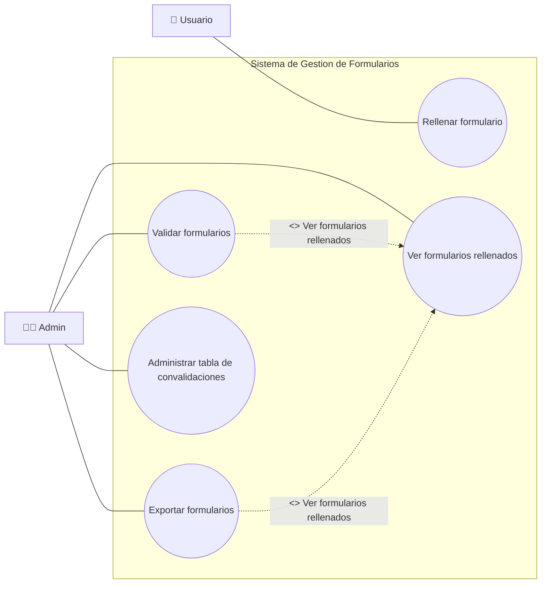

# Resumen de implementacion - Backend DB (SQLite)

## 1) Objetivo cumplido
Se implemento en `backend` un modulo Python que encapsula la logica de acceso a SQLite, junto con scripts de inicializacion/carga y un inventario formal de contratos de entrada/salida.

Archivos principales:
- `backend/scripts/schema.sql`
- `backend/app/db/database.py`
- `backend/app/db/contracts.py`
- `backend/scripts/init_db.py`
- `backend/scripts/load_catalog.py`
- `backend/scripts/load_convalidaciones.py`
- `backend/scripts/export_formularios.py`
- `backend/scripts/README.md`

## 2) Casos de uso y cobertura



Estado de cobertura:

| Caso de uso | Estado | Cobertura en codigo |
|---|---|---|
| UC1 Rellenar formulario | Completo | Alta y listado de formularios/subentidades (`formulario_solicitudes`, `formulario_modulos_aportados`, `formulario_archivos`) + catalogo para seleccion |
| UC2 Ver formularios rellenados | Completo | `list_formularios` y listados de subentidades |
| UC3 Validar formularios | Completo | Transiciones de estado + consulta de destinos por origen + consulta de reglas por `origen+destino` |
| UC4 Exportar formularios | Completo | Reutiliza `list_formularios` como base y script `export_formularios.py` para salida JSON |
| UC5 Administrar tabla de convalidaciones | Completo | Alta/consulta de convalidaciones (origenes definidos en alta) + carga masiva desde JSON/SQLite fuente |

## 3) Esquema SQLite implementado

Se definio el esquema completo con las 11 tablas pedidas:
- `grados`
- `familias`
- `ciclos`
- `modulos`
- `convalidacion`
- `convalidacion_origen`
- `usuarios`
- `formularios`
- `formulario_solicitudes`
- `formulario_modulos_aportados`
- `formulario_archivos`

Diseno aplicado:
- Integridad referencial con `FOREIGN KEY` y politicas `ON DELETE CASCADE`/`SET NULL`.
- Reglas de negocio en DB con `CHECK` (roles `ALUMNO/ADMIN`, estados de formulario, `rule_mode`, `estado_evaluacion`).
- Restricciones `UNIQUE` para evitar duplicados de catalogo.
- Indices para consultas frecuentes (catalogo, formularios, convalidaciones).
- Triggers `updated_at` para mantener auditoria temporal de tablas actualizables.

## 4) Diseno del modulo Python de BD

### 4.1 Arquitectura
- `database.py` concentra toda la interaccion SQL.
- `contracts.py` documenta contratos de entrada/salida exactos por caso de uso.
- Los scripts en `backend/scripts` ejecutan inicializacion y cargas masivas reutilizando `database.py`.

### 4.2 Decisiones tecnicas tomadas
1. Conexion robusta SQLite:
   `row_factory = sqlite3.Row`, `PRAGMA foreign_keys = ON`, `journal_mode = WAL`, `synchronous = NORMAL`.
2. Transacciones seguras:
   contexto `transaction(conn)` con soporte de uso anidado.
3. Validaciones tempranas:
   `_require_non_empty`, `_assert_rule_mode`, `_assert_formulario_estado`, `_assert_formulario_transition`.
4. Paginacion controlada:
   `_normalize_limit_offset` limita rango (`limit` 1..500, `offset >= 0`).
5. Catalogo simplificado por casos de uso:
   creacion explicita con `create_grado`, `create_familia`, `create_ciclo`, `create_modulo`
   y busqueda unificada con `get_catalog_entity` para autocompletado.
6. Flujo de convalidacion por consulta:
   `get_catalog_entity(..., id_modulo_origen=...)` devuelve destinos posibles desde un origen.
7. Reglas por par origen/destino:
   `list_convalidaciones_by_origen_destino(...)` devuelve reglas concretas para ese par.
8. Encapsulacion reforzada:
   operaciones de limpieza y busqueda de catalogo/convalidaciones usadas por scripts se centralizaron en `database.py`.

## 5) Inventario de funciones por caso de uso (entrada/salida exacta)

La fuente formal de contratos esta en `backend/app/db/contracts.py` (`FUNCTION_CONTRACTS`).
Abajo se resume por caso de uso con firmas exactas.

### UC1 - Rellenar formulario

```python
# Catalogo para selecciones del formulario
get_catalog_entity(
    conn: sqlite3.Connection,
    search: Optional[str] = None,
    *,
    id_modulo_origen: Optional[int] = None,
    limit: int = 100,
    offset: int = 0,
) -> Sequence[sqlite3.Row]

# Carga y mantenimiento de catalogo academico
create_grado(conn: sqlite3.Connection, nombre: str) -> int
create_familia(conn: sqlite3.Connection, nombre: str, id_grado: int) -> int
create_ciclo(
    conn: sqlite3.Connection,
    nombre: str,
    id_familia: int,
    *,
    titulo: Optional[str] = None,
    id_oficial: Optional[str] = None,
    normativa: Optional[str] = None,
) -> int
create_modulo(
    conn: sqlite3.Connection,
    nombre: str,
    id_ciclo: int,
    *,
    id_oficial: Optional[str] = None,
) -> int

# Formulario base
create_formulario(
    conn: sqlite3.Connection,
    id_alumno: int,
    estado: FormularioEstado = "BORRADOR",
    anotaciones: Optional[str] = None,
) -> int
list_formularios(
    conn: sqlite3.Connection,
    id_alumno: Optional[int] = None,
    estado: Optional[FormularioEstado] = None,
    limit: int = 100,
    offset: int = 0,
) -> Sequence[sqlite3.Row]
get_formulario_detalle(
    conn: sqlite3.Connection,
    formulario_id: int,
) -> Optional[dict[str, Any]]
change_formulario_status(
    conn: sqlite3.Connection,
    formulario_id: int,
    new_estado: FormularioEstado,
    *,
    validado_por: Optional[int] = None,
    anotaciones: Optional[str] = None,
) -> bool

# Solicitudes del formulario (modulos destino a convalidar)
create_formulario_solicitud(
    conn: sqlite3.Connection,
    id_formulario: int,
    id_modulo: Optional[int],
    id_convalidacion: Optional[int] = None,
    descripcion: Optional[str] = None,
) -> int
list_formulario_solicitudes(conn: sqlite3.Connection, id_formulario: int) -> Sequence[sqlite3.Row]

# Modulos aportados por el alumno
create_formulario_modulo_aportado(
    conn: sqlite3.Connection,
    id_formulario: int,
    id_modulo: Optional[int] = None,
    descripcion: Optional[str] = None,
) -> int
list_formulario_modulos_aportados(conn: sqlite3.Connection, id_formulario: int) -> Sequence[sqlite3.Row]

# Archivos adjuntos
create_formulario_archivo(
    conn: sqlite3.Connection,
    id_formulario: int,
    nombre_archivo: str,
    ruta_almacenamiento: str,
    *,
    descripcion: Optional[str] = None,
    mime_type: Optional[str] = None,
    size_bytes: Optional[int] = None,
) -> int
list_formulario_archivos(conn: sqlite3.Connection, id_formulario: int) -> Sequence[sqlite3.Row]
```

### UC2 - Ver formularios rellenados

```python
list_formularios(
    conn: sqlite3.Connection,
    id_alumno: Optional[int] = None,
    estado: Optional[FormularioEstado] = None,
    limit: int = 100,
    offset: int = 0,
) -> Sequence[sqlite3.Row]
get_formulario_detalle(
    conn: sqlite3.Connection,
    formulario_id: int,
) -> Optional[dict[str, Any]]
```

### UC3 - Validar formularios

```python
get_catalog_entity(
    conn: sqlite3.Connection,
    search: Optional[str] = None,
    *,
    id_modulo_origen: Optional[int] = None,
    limit: int = 100,
    offset: int = 0,
) -> Sequence[sqlite3.Row]
list_convalidaciones_by_origen_destino(
    conn: sqlite3.Connection,
    id_modulo_origen: int,
    id_modulo_destino: int,
) -> Sequence[sqlite3.Row]
change_formulario_status(
    conn: sqlite3.Connection,
    formulario_id: int,
    new_estado: FormularioEstado,
    *,
    validado_por: Optional[int] = None,
    anotaciones: Optional[str] = None,
) -> bool
```

### UC4 - Exportar formularios

Cobertura actual en backend DB:

```python
list_formularios(
    conn: sqlite3.Connection,
    id_alumno: Optional[int] = None,
    estado: Optional[FormularioEstado] = None,
    limit: int = 100,
    offset: int = 0,
) -> Sequence[sqlite3.Row]
```

Script operativo:
- `backend/scripts/export_formularios.py` genera JSON desde el listado de formularios.

### UC5 - Administrar tabla de convalidaciones

```python
create_convalidacion(
    conn: sqlite3.Connection,
    id_modulo_destino: int,
    source_link: Optional[str],
    source_page: Optional[int],
    origen_modulos: Iterable[int],
    *,
    rule_mode: RuleMode = "ALL",
    source_doc: Optional[str] = None,
    source_anexo: Optional[int] = None,
) -> int
get_convalidacion(conn: sqlite3.Connection, conv_id: int) -> Optional[sqlite3.Row]
list_convalidaciones_by_origen_destino(
    conn: sqlite3.Connection,
    id_modulo_origen: int,
    id_modulo_destino: int,
) -> Sequence[sqlite3.Row]
# update_convalidacion: pendiente de definicion funcional (aplazada)
```

## 6) Funciones de soporte transversales

```python
connect(config: DBConfig) -> sqlite3.Connection
close(conn: sqlite3.Connection) -> None
init_db(config: DBConfig) -> None
healthcheck(conn: sqlite3.Connection) -> dict[str, Any]
transaction(conn: sqlite3.Connection) -> ContextManager

create_usuario(conn: sqlite3.Connection, nombre: str, email: str, rol: Literal["ALUMNO", "ADMIN"] = "ALUMNO", *, password: Optional[str] = None) -> int
login_admin(conn: sqlite3.Connection, email: str, password: str) -> Optional[sqlite3.Row]
```

## 7) Scripts operativos implementados

`backend/scripts/init_db.py`
- Inicializa DB y aplica `schema.sql`.

`backend/scripts/load_catalog.py`
- Carga catalogo FP (`grados/familias/ciclos/modulos`) desde JSON.
- Soporta `--truncate` para recarga completa.

`backend/scripts/load_convalidaciones.py`
- Carga reglas desde JSON o desde SQLite fuente (`Convalidacion` + `Convalidacion_links`).
- Soporta `--reset` para limpiar reglas previas.

`backend/scripts/export_formularios.py`
- Exporta el listado de formularios en formato JSON, con filtros por alumno/estado y paginacion.

`backend/scripts/README.md`
- Documenta comandos de uso rapido de los scripts.

## 8) Validacion de implementacion

Validaciones registradas durante la implementacion:
- Compilacion Python sin errores de sintaxis.
- Flujo E2E probado:
  - `init_db` OK.
  - `load_catalog` OK (`4 grados`, `81 familias`, `218 ciclos`, `3272 modulos`).
  - `load_convalidaciones` OK desde SQLite fuente (`281 reglas`).

Validacion adicional en esta revision:
- `python -m py_compile backend/app/db/contracts.py backend/app/db/database.py backend/scripts/init_db.py backend/scripts/load_catalog.py backend/scripts/load_convalidaciones.py backend/scripts/export_formularios.py` -> OK.

## 9) Revision Punto Por Punto (Con Citas)

Definicion de tablas pedidas: cumplido.
- `backend/scripts/schema.sql:13`
- `backend/scripts/schema.sql:19`
- `backend/scripts/schema.sql:28`
- `backend/scripts/schema.sql:40`
- `backend/scripts/schema.sql:53`
- `backend/scripts/schema.sql:65`
- `backend/scripts/schema.sql:76`
- `backend/scripts/schema.sql:86`
- `backend/scripts/schema.sql:101`
- `backend/scripts/schema.sql:116`
- `backend/scripts/schema.sql:127`

Scripts de inicializacion/carga: cumplido.
- `backend/scripts/init_db.py:28`
- `backend/scripts/load_catalog.py:62`
- `backend/scripts/load_convalidaciones.py:194`

Modulo Python DB encapsulando logica principal: cumplido.
- Infraestructura de conexion e inicializacion: `backend/app/db/database.py`
- Dominio principal (catalogo/convalidaciones/formularios): `backend/app/db/database.py`
- Consultas de destinos/reglas por origen+destino: `backend/app/db/database.py`
- Detalle consolidado de formulario en una llamada: `backend/app/db/database.py`
- UC4 exportacion por listado: `backend/app/db/database.py`, `backend/scripts/export_formularios.py`

Diseño con funciones identificadas + I/O exacto: cumplido.
- Inventario formal: `backend/app/db/contracts.py:75`
- Cobertura verificada: 27 funciones publicas en `database.py` y 27 funciones inventariadas en `FUNCTION_CONTRACTS`.
Listado completo de funciones publicas del modulo DB (agrupadas por categoria):

Total: 27 funciones.

### Infraestructura
```python
def transaction(conn: sqlite3.Connection):  # Ejecuta un bloque de escritura dentro de una transaccion segura.
def connect(config: DBConfig) -> sqlite3.Connection:  # Abre una conexion SQLite configurada para el proyecto.
def close(conn: sqlite3.Connection) -> None:  # Cierra la conexion activa con la base de datos.
def healthcheck(conn: sqlite3.Connection) -> dict[str, Any]:  # Comprueba conectividad y metadatos basicos de la base de datos.
def init_db(config: DBConfig) -> None:  # Inicializa la base de datos aplicando el esquema SQL.
```

### Catalogo Academico
```python
def clear_catalog(conn: sqlite3.Connection) -> None:  # Limpia el catalogo completo eliminando grados en cascada.
def create_grado(conn: sqlite3.Connection, nombre: str) -> int:  # Crea un nuevo grado.
def create_familia(conn: sqlite3.Connection, nombre: str, id_grado: int) -> int:  # Crea una nueva familia vinculada a un grado.
def create_ciclo( conn: sqlite3.Connection, nombre: str, id_familia: int, *, titulo: Optional[str] = None, id_oficial: Optional[str] = None, normativa: Optional[str] = None, ) -> int:  # Crea un nuevo ciclo vinculado a una familia.
def create_modulo( conn: sqlite3.Connection, nombre: str, id_ciclo: int, *, id_oficial: Optional[str] = None, ) -> int:  # Crea un nuevo modulo vinculado a un ciclo.
def get_catalog_entity( conn: sqlite3.Connection, search: Optional[str] = None, *, id_modulo_origen: Optional[int] = None, limit: int = 100, offset: int = 0, ) -> Sequence[sqlite3.Row]:  # Busca en catalogo academico o destinos convalidables por modulo origen.
```

### Convalidaciones
```python
def clear_convalidaciones(conn: sqlite3.Connection) -> None:  # Limpia todas las convalidaciones y sus modulos origen.
def create_convalidacion( conn: sqlite3.Connection, id_modulo_destino: int, source_link: Optional[str], source_page: Optional[int], origen_modulos: Iterable[int], *, rule_mode: RuleMode = "ALL", source_doc: Optional[str] = None, source_anexo: Optional[int] = None, ) -> int:  # Crea una regla de convalidacion y registra sus modulos de origen.
def get_convalidacion(conn: sqlite3.Connection, conv_id: int) -> Optional[sqlite3.Row]:  # Obtiene un registro de convalidacion por su identificador o criterio.
def list_convalidaciones_by_origen_destino( conn: sqlite3.Connection, id_modulo_origen: int, id_modulo_destino: int, ) -> Sequence[sqlite3.Row]:  # Lista convalidaciones para un par origen+destino.
# def update_convalidacion(...): pendiente de definicion funcional (aplazada).
```

### Usuarios
```python
def create_usuario( conn: sqlite3.Connection, nombre: str, email: str, rol: Literal["ALUMNO", "ADMIN"] = "ALUMNO", *, password: Optional[str] = None, ) -> int:  # Crea un usuario; si es ADMIN requiere password.
def login_admin(conn: sqlite3.Connection, email: str, password: str) -> Optional[sqlite3.Row]:  # Inicia sesion admin validando contraseña.
```

### Formularios
```python
def create_formulario( conn: sqlite3.Connection, id_alumno: int, estado: FormularioEstado = "BORRADOR", anotaciones: Optional[str] = None, ) -> int:  # Crea un nuevo formulario para un alumno.
def list_formularios( conn: sqlite3.Connection, id_alumno: Optional[int] = None, estado: Optional[FormularioEstado] = None, limit: int = 100, offset: int = 0, ) -> Sequence[sqlite3.Row]:  # Lista registros de formularios con los filtros disponibles.
def get_formulario_detalle( conn: sqlite3.Connection, formulario_id: int, ) -> Optional[dict[str, Any]]:  # Obtiene el detalle consolidado de un formulario.
def change_formulario_status( conn: sqlite3.Connection, formulario_id: int, new_estado: FormularioEstado, *, validado_por: Optional[int] = None, anotaciones: Optional[str] = None, ) -> bool:  # Cambia el estado del formulario validando la transicion permitida.
def create_formulario_solicitud( conn: sqlite3.Connection, id_formulario: int, id_modulo: Optional[int], id_convalidacion: Optional[int] = None, descripcion: Optional[str] = None, ) -> int:  # Crea una solicitud dentro de un formulario.
def list_formulario_solicitudes( conn: sqlite3.Connection, id_formulario: int, ) -> Sequence[sqlite3.Row]:  # Lista registros de formulario solicitudes con los filtros disponibles.
def create_formulario_modulo_aportado( conn: sqlite3.Connection, id_formulario: int, id_modulo: Optional[int] = None, descripcion: Optional[str] = None, ) -> int:  # Crea un registro de modulo aportado en un formulario.
def list_formulario_modulos_aportados( conn: sqlite3.Connection, id_formulario: int, ) -> Sequence[sqlite3.Row]:  # Lista registros de formulario modulos aportados con los filtros disponibles.
def create_formulario_archivo( conn: sqlite3.Connection, id_formulario: int, nombre_archivo: str, ruta_almacenamiento: str, *, descripcion: Optional[str] = None, mime_type: Optional[str] = None, size_bytes: Optional[int] = None, ) -> int:  # Crea un registro de archivo adjunto para un formulario.
def list_formulario_archivos( conn: sqlite3.Connection, id_formulario: int, ) -> Sequence[sqlite3.Row]:  # Lista registros de formulario archivos con los filtros disponibles.
```

## 10) Conclusiones

Resultado:
- La tarea principal del modulo Python de interaccion con SQLite esta implementada y operativa.
- El diseno de funciones y contratos existe y esta documentado con inventario completo en `FUNCTION_CONTRACTS` (cobertura 27/27 funciones publicas del modulo DB).
- Los casos de uso UC1..UC5 quedan cubiertos en backend (UC4 se resuelve mediante listado de formularios).
