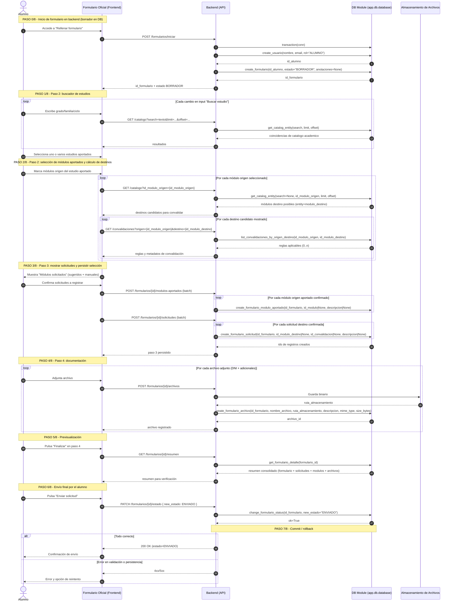
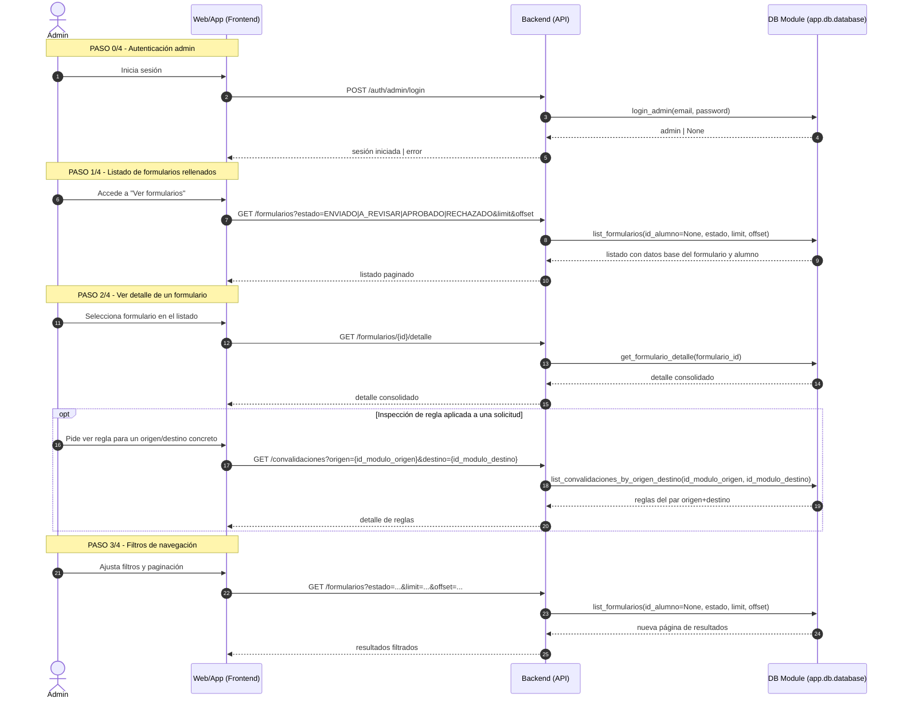
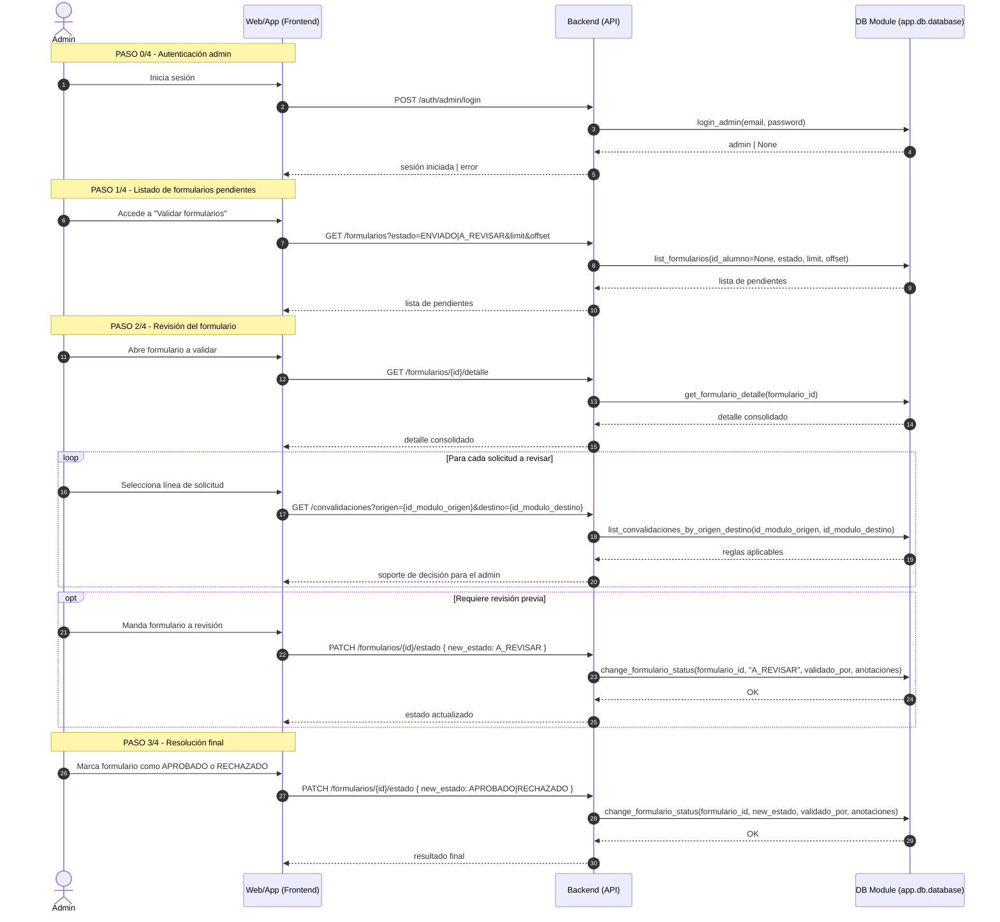
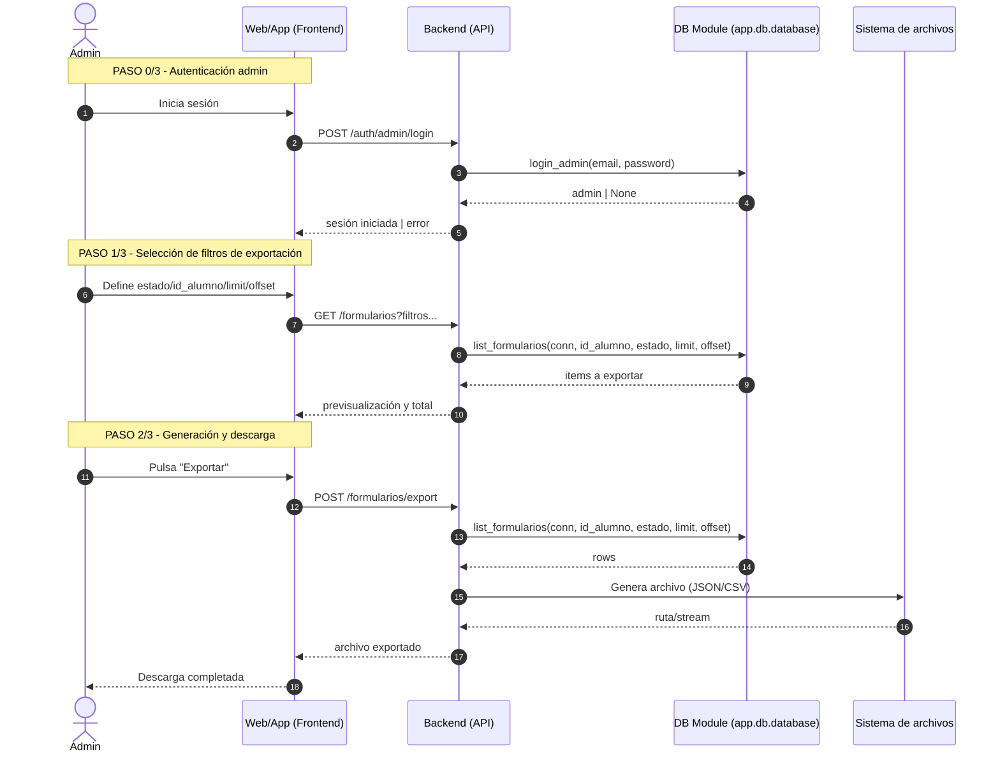
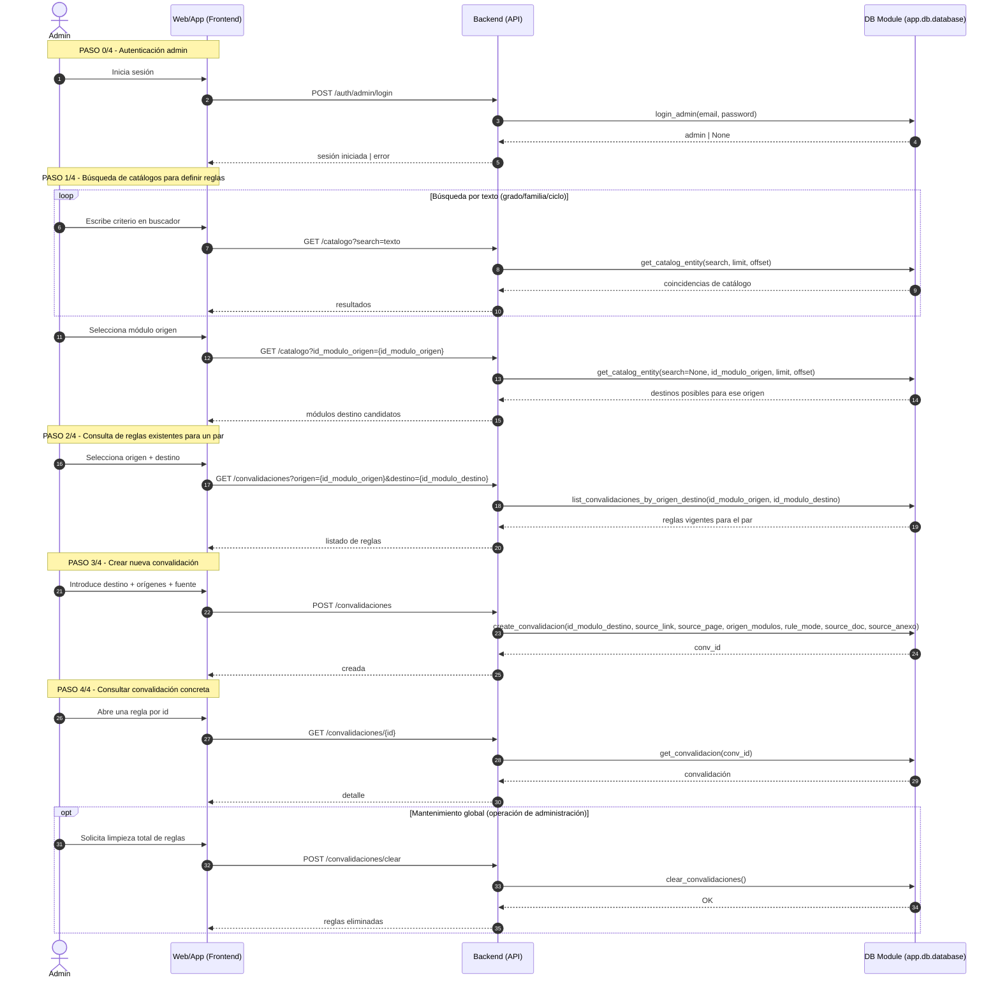

# Diagramas de Secuencia (UC1, UC2, UC3, UC4 y UC5)

## UC1 - Rellenar formulario

Funciones backend citadas:

- `get_catalog_entity(...)` en `backend/app/db/database.py:349`
- `transaction(...)` en `backend/app/db/database.py:210`
- `create_usuario(...)` en `backend/app/db/database.py:619`
- `create_formulario(...)` en `backend/app/db/database.py:689`
- `create_formulario_modulo_aportado(...)` en `backend/app/db/database.py:982`
- `list_convalidaciones_by_origen_destino(...)` en `backend/app/db/database.py:573`
- `create_formulario_solicitud(...)` en `backend/app/db/database.py:941`
- `create_formulario_archivo(...)` en `backend/app/db/database.py:1022`
- `get_formulario_detalle(...)` en `backend/app/db/database.py`
- `change_formulario_status(...)` en `backend/app/db/database.py:902`

## UC2 - Ver formulario

Funciones backend citadas:

- `login_admin(...)` en `backend/app/db/database.py:648`
- `list_formularios(...)` en `backend/app/db/database.py:710`
- `get_formulario_detalle(...)` en `backend/app/db/database.py`
- `list_convalidaciones_by_origen_destino(...)` en `backend/app/db/database.py:573`

## UC3 - Validar formulario

Funciones backend citadas:

- `login_admin(...)` en `backend/app/db/database.py:648`
- `list_formularios(...)` en `backend/app/db/database.py:710`
- `get_formulario_detalle(...)` en `backend/app/db/database.py`
- `list_convalidaciones_by_origen_destino(...)` en `backend/app/db/database.py:573`
- `change_formulario_status(...)` en `backend/app/db/database.py:902`

Nota de alcance:

- No existe función pública para aprobar/rechazar cada solicitud de forma individual.
- La validación actual se aplica al formulario completo mediante `change_formulario_status(...)`.

## UC4 - Exportar formularios

Funciones backend citadas:

- `login_admin(...)` en `backend/app/db/database.py:648`
- `list_formularios(...)` en `backend/app/db/database.py:710`

## UC5 - Administrar convalidaciones

Funciones backend citadas:

- `login_admin(...)` en `backend/app/db/database.py:648`
- `get_catalog_entity(...)` en `backend/app/db/database.py:349`
- `list_convalidaciones_by_origen_destino(...)` en `backend/app/db/database.py:573`
- `create_convalidacion(...)` en `backend/app/db/database.py:528`
- `get_convalidacion(...)` en `backend/app/db/database.py:565`
- `clear_convalidaciones(...)` en `backend/app/db/database.py:521`

Nota de alcance:

- No existen funciones públicas activas para `update` o `delete` de convalidaciones.
- El flujo actual es alta + consulta, y búsqueda dirigida por origen/destino.
